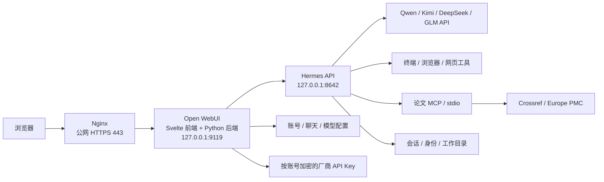

# 实际架构与源码盘点

核对日期：2026-09-08。服务器检查只读取目录、文件存在性及镜像元数据，没有导出凭据或业务数据。

## 服务器到底有没有源码

| 组件 | 生产位置 | 核对结果 | 开发入口 |
| --- | --- | --- | --- |
| Hermes | `/home/ubuntu/haudi-hermes/source` | Python 运行源码，有本项目修改；没有 `.git`，不是可以正常提交 PR 的开发检出 | `reference/hermes-agent` |
| UI 前端 | 容器 `/app/build` | 编译后的前端产物；不存在 `/app/src` | `reference/open-webui/src` |
| UI 后端 | 容器 `/app/backend/open_webui` | Python 后端源码；属于镜像文件，不是持久的开发目录 | `reference/open-webui/backend/open_webui` |
| UI 构建材料 | `openwebui/research-customization` | 从镜像提取的旧产物和覆盖层，不能替代完整前端源码 | 本项目补丁和固定上游检出 |
| UI 数据 | `openwebui/data` | 账号和聊天数据库、文件等持久数据 | 仅运维，不进源码库 |
| Agent 数据 | `state`、`workspace` | 模型凭据、会话、SOUL 和共享工作目录 | 开发使用独立目录 |

根路径均相对于 `/home/ubuntu/haudi-hermes`。服务器还有一次未完成拉取留下的 `source-fetch-incomplete/.git`，它不是当前运行源码的版本依据。

## 版本依据

Hermes 的本地基线是 `693641aa8b4359c602283bdbbc14041e03bc47bc`，版本 0.21.0。服务器源码由之前的部署材料导入，当前没有 Git 元数据；本次未对整棵运行目录逐文件校验，不能声称所有文件与基线完全一致。

UI 显示版本 0.11.3，但原始 `main-slim` 镜像的 OCI `org.opencontainers.image.revision` 为 `0a7c15832fb30b1903753e83f81dc7d27e5b0944`。正式标签 `v0.11.3` 指向 `2a960a59fe1dbbd35282f0556b3666d81102e781`。开发必须使用锁文件中的实际镜像提交，而不是只看版本号或继续拉取浮动 `main`。

生产 UI 为 `haudi-openwebui:0.11.3-research-v5`，镜像 ID 与基线 ID 记录在根目录锁文件。v5 使用固定上游源码加产品补丁，已在 Node.js 22 下完整构建前端，并替换对应 Python 后端；依赖层沿用 v4。模型目录、账号密钥和实际 Agent 调用已完成验收。发布材料在服务器 `model-releases/` 下，开发仍以团队仓库和固定上游检出为准。截图与模型配置实现均来自 `overlays/`，通过补丁生成器注入源码。

## 已有能力和待建模块

已有：账号登录、科研任务聊天、模型调用、执行引擎工具、科研文案、身份规则，以及论文检索可行性实测。2026-09-08 另已安装中英文文档检索模型，验证文本上传、网页索引与聊天引用，修复历史失败文件和截图入口反馈。论文检索调研见上一层的调研报告。

扩展接入：`extensions/` 保存项目 Skill、MCP 服务和 Hermes 原生插件，配置清单为 `configs/workstation/extensions.json`。论文 MCP 提供 Crossref 检索 / DOI 核对、Europe PMC 检索 / 开放正文片段，配套 `research-literature` Skill 与 `research-citations` 插件。发布到服务器 `extensions/releases/` 和 `state/skills`、`state/plugins`，不修改上游核心。具体教程见 [Skill](SKILL-INTEGRATION.md)、[MCP](MCP-INTEGRATION.md)、[插件](PLUGIN-INTEGRATION.md)。

待建：更多学术数据库、完整检索分页与论文对象管理、通用全文与图表解析、细分科研角色权限、专门审计与报告模块。当前账号分开，Agent 工作目录和扩展配置仍共享，不能视为已经实现多租户文件或 MCP 凭据隔离。需求文档里的 Django、Vue、MySQL 属于建议架构，目前生产没有这些独立服务。

## 为什么之前难以接手

本项目根目录此前没有 README、上游版本锁和开发入口；只有 Hermes 的本地参考检出。产品配置夹在一百多个部署和排障脚本之间，UI 修改直接操作压缩 bundle，身份修改还涉及服务器文件和模型数据库。仅拿到目录不能可靠还原所有步骤。

现在用“固定上游源码 + 主仓库补丁 + 独立产品配置”表达定制，团队仓库为 `AcademicResearchAgent/Academic-Research-Hub`。已有脚本暂不整批移动，以免破坏远端执行路径；按开发指南区分日常入口和历史操作。完整的新机部署自动化和 CI 仍需后续建设，不把本次目录整理称为全自动交付完成。
