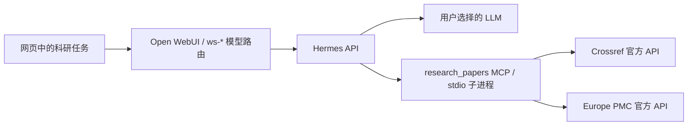

# MCP 接入与论文服务教程

核对日期：2026-09-08。教程针对本项目锁定的 Hermes `693641aa…` 和 Open WebUI `0a7c1583…`（0.11.3）；线上能力以发布记录和实测为准。

## 1. 当前接入方式



Hermes 原生支持 stdio 和远程 HTTP MCP。将服务写入当前 profile 的 `config.yaml` 后，由执行引擎发现并注册工具。[Hermes 官方 MCP 文档](https://github.com/NousResearch/hermes-agent/blob/693641aa8b4359c602283bdbbc14041e03bc47bc/website/docs/user-guide/features/mcp.md)。

本项目采用 **Hermes 直接连接 MCP**，让工具调用与 Agent 的多轮规划在同一执行循环中完成。无需修改 Qwen、Kimi、DeepSeek、GLM 的模型目录；实际调用效果仍取决于所选模型的工具调用能力。

## 2. 本次配置的服务

服务源码：[`extensions/mcp/paper-search/server.py`](../../extensions/mcp/paper-search/server.py)。这是**本项目开发的适配器**，使用官方 MCP Python SDK 和论文数据源官方接口，不是 Crossref / Europe PMC 官方提供的 MCP 产品。

| Hermes 中的实际工具名 | 用途 | 返回限制 |
| --- | --- | --- |
| `mcp__research_papers__crossref_search` | 跨学科学术元数据检索 | 单次 1–10 条，不保证有摘要 |
| `mcp__research_papers__crossref_lookup` | 已知 Crossref DOI 的元数据核对 | 其他 DOI 注册机构的记录可能查不到 |
| `mcp__research_papers__europepmc_search` | 生命科学论文及摘要检索 | 包含 PubMed 等来源，不是全学科完整覆盖 |
| `mcp__research_papers__europepmc_fulltext` | 通过 PMCID 读取开放正文片段 | 每次默认 12,000 字符，最多 20,000；可按 `next_offset` 分页 |

名称中的双下划线是**当前运行源码实测结果**。上游文档部分示例仍用单下划线；升级时重新发现工具，不凭字符串惯例推断名称。

Crossref 提供注册元数据，公开 REST API 无需注册；元数据中的 DOI 链接并不表示已获得正文。[Crossref REST API](https://www.crossref.org/documentation/retrieve-metadata/rest-api/)。Europe PMC 的 `fullTextXML` 对应可提供的开放获取全文，不能绕过出版商访问限制。[Europe PMC REST API](https://europepmc.org/RestfulWebService)。

适配器当前不要求额外 API Key。它不存储用户文献库、不接受任意下载 URL、不访问本地文件；查询词会发送给相应论文服务。正文提取保留段落和标题，不完整处理图、表、补充材料或 PDF。搜索没有实现游标翻页，不适合直接宣称完成穷尽检索。

2026-09-08 部署验收：release `6e444299f0c0e64e`；Hermes 健康检查通过；实际检索并核对 DOI `10.1089/crispr.2018.29011.rba`，读取 `PMC13420333` 的 1,000 字符正文片段；Plugin Doctor 通过。HTTPS 网页聊天接口选用 DeepSeek V4 Flash，持久化工具记录确认 Skill、四个 MCP 工具和引用插件均执行成功。其他厂商模型本次未逐一测试。当前 Skill 文件总数为 61，不能据此认定其他 60 个 Skill 全部经过验收。

## 3. 源码、配置与运行目录

```text
extensions/mcp/paper-search/                 服务源码与固定依赖
configs/workstation/extensions.json          项目发布配置
scripts/package_extensions.py                打包源码与部署器
deploy/hermes/deploy-extensions.py            依赖安装、备份、配置合并、回退
deploy/hermes/verify-extensions.py            真实工具注册与网络调用验收
```

服务器根目录为 `/home/ubuntu/haudi-hermes`。部署器将发布包解到 `extensions/releases/<release-id>/`，根据以下模板更新 `state/config.yaml`；占位符由部署器展开，不能原样复制到 Hermes 配置：

```yaml
mcp_servers:
  research_papers:
    command: /home/ubuntu/haudi-hermes/venv/bin/python
    args:
      - /home/ubuntu/haudi-hermes/extensions/releases/<release-id>/mcp/paper-search/server.py
    enabled: true
    timeout: 60
    connect_timeout: 30
    supports_parallel_tool_calls: false
    tools:
      include: [crossref_search, crossref_lookup, europepmc_search, europepmc_fulltext]
      resources: false
      prompts: false
```

`platform_toolsets.api_server` 同时包含 `research_papers`。这是 MCP 服务名，不是 `mcp` 或某个完整工具名。工具白名单使用服务原始名称；资源与提示词封装未启用，因为该服务只提供四个业务工具。

stdio 子进程由 Hermes 管理，随调用连接启动，父服务重启时重建。没有新增公网端口，也没有独立的论文 MCP systemd 服务。管理员仍管理 `haudi-hermes-api.service`。

生产原来缺少 MCP SDK，本次安装 `mcp==1.26.0` 及缺失依赖。部署器约束所有已安装包的版本，禁止通过这次扩展发布升级原有依赖；冲突时停止。新增包版本记录在 `requirements.txt`，现有运行依赖版本记录在服务器 `extensions/existing-packages.txt`。这不是从零安装整个工作站的脚本。

## 4. 发布与验证

在本地仓库根目录 PowerShell 中运行：

```powershell
python -m unittest discover -s tests -p test_extensions.py -v
python scripts/package_extensions.py
python deploy/hermes/upload.py .build/extensions.zip /home/ubuntu/haudi-hermes/extensions.zip
python deploy/hermes/upload.py deploy/hermes/deploy-extensions.py /home/ubuntu/haudi-hermes/deploy-extensions.py
python deploy/hermes/remote.py deploy/hermes/deploy-extensions.sh
```

需要项目既有 SSH 配置。归档只包含扩展源码、配置、依赖清单和两个部署 / 验证脚本，不包含账号库、模型 Key 或 `state` 数据。

脚本会验证 Skill 加载、四个 MCP 工具的实际调用和引用插件。此步骤访问公开论文接口，不调用 LLM。通过后重启 Hermes 并检查健康；激活验证失败会恢复备份配置和被管理目录。

服务器上可重复执行当前 release 的验证：

```bash
cd /home/ubuntu/haudi-hermes
release=$(venv/bin/python -c 'import json; print(json.load(open("extensions/deployment.json"))["release"])')
venv/bin/python "extensions/releases/$release/verify-extensions.py"
```

最后在网页选择已配置 Key 的模型，新建任务：

> 加载 research-literature 技能，检索两篇 CRISPR 开放论文，用 Europe PMC 工具读取其中一篇的正文片段，列出 DOI、来源链接及证据层级。

网页真实聊天会调用用户模型 API。验收应确认模型执行了实际工具调用，而不只看它声称“已检索”。服务器 `extensions/verification.json` 记录不调用 LLM 的验收结果；`extensions/chat-verification.json` 记录本次网页聊天接口的实际工具调用检查。

如需重复完整 HTTPS 验收，在本地执行下列命令。脚本只在服务器内使用管理员测试账号；已有个人 Key 时保留原值，没有时临时使用服务器既有 DeepSeek Key，结束后移除临时项。它会产生模型调用费用，不建议作为高频健康探针。

```powershell
python deploy/hermes/upload.py deploy/hermes/verify-extensions-chat.py /home/ubuntu/haudi-hermes/verify-extensions-chat.py
python deploy/hermes/remote.py deploy/hermes/verify-extensions-chat.sh
```

## 5. 再接一个 MCP

**本地 stdio 服务**：先将审查过的源码放到 `extensions/mcp/<服务名>/`，固定依赖；再在配置清单的 `mcp_servers` 增加 `command` 和分开的 `args`。不要把整条 shell 命令塞进 `command`。同时将服务名加入 `api_toolsets`，为新服务增加对应验收。当前部署器只自动安装论文服务的 requirements；其他依赖要显式扩展部署步骤或使用独立 venv。

最小服务使用官方 SDK：

```python
from mcp.server.fastmcp import FastMCP

server = FastMCP("lab_catalog")

@server.tool()
def lookup_protocol(protocol_id: str) -> dict:
    """Read a protocol from the team's catalog."""
    # 实现真实查询、参数校验和错误处理；不要返回伪造成功。
    raise NotImplementedError("Connect the actual protocol catalog before enabling")

if __name__ == "__main__":
    server.run(transport="stdio")
```

该片段是开发骨架，不属于已经部署的能力。[官方 Python SDK v1.26.0](https://github.com/modelcontextprotocol/python-sdk/tree/v1.26.0)。

**远程 Streamable HTTP 服务**：在清单中使用服务商给出的真实 `url`，按其要求配置认证，例如：

```yaml
mcp_servers:
  team_library:
    url: https://mcp.example.org/mcp
    headers:
      Authorization: "Bearer ${TEAM_LIBRARY_TOKEN}"
    timeout: 60
    enabled: true
```

`example.org` 是占位地址，不能直接使用。密钥在服务器 `state/.env` 中配置，保持权限 600，仓库只保留变量引用。Hermes 支持环境变量展开；stdio 子进程使用经过筛选的环境，需要的变量通过 `env` 显式传递。OAuth 服务按上游 MCP 登录流程授权，不把 token 写入 Skill。

当前 `HERMES_HOME` 是共享 profile，以上密钥也是服务级共享凭据，**不是按网页账号隔离**。私有 Zotero、机构文献库等接入前，需要实现用户身份传递、服务端权限检查和凭据隔离。个人 LLM Key 管理没有自动覆盖这些需求。

## 6. 运维与回退

服务器终端：

```bash
sudo systemctl status haudi-hermes-api.service --no-pager
curl --fail http://127.0.0.1:8642/health
cat /home/ubuntu/haudi-hermes/extensions/deployment.json
cat /home/ubuntu/haudi-hermes/extensions/verification.json
```

成功发布记录包含 release ID 和 `backup` 路径。回退最近一次成功发布前的扩展配置：

```bash
cd /home/ubuntu/haudi-hermes
backup=$(venv/bin/python -c 'import json; print(json.load(open("extensions/deployment.json"))["backup"])')
venv/bin/python deploy-extensions.py --rollback "$backup"
```

备份含原 `config.yaml`，位于权限 700 的 `extensions/backups/<时间>/`；不要提交到 Git 或展示内容。回退保留已新增的 Python 依赖包，不自动卸载共享环境依赖；配置和项目 Skill / 插件目录会恢复。`deployment.json` 是最后成功发布的记录，手动回退后它不会自动变成旧版本清单，应结合当前 `state/config.yaml` 核实状态。

若要永久停用论文 MCP，在源配置中设 `enabled: false`，同时调整验收脚本预期后发布；临时排障可在服务器改同一字段并重启，但后续发布会以仓库配置为准。不要清空整段 `mcp_servers`。服务日志在 `state/logs/mcp-stderr.log`；检索词可能进入日志，按研究资料管理。

## 7. Open WebUI 的 MCP 入口为何不是主接入点

上游支持管理员在 Settings → Admin → Integrations → External Tool Servers 添加 **MCP (Streamable HTTP)**。原生不接 stdio；`mcpo` 可将 stdio 等协议桥接为 OpenAPI，届时应按 OpenAPI 连接类型配置。[Open WebUI 官方 MCP 文档](https://docs.openwebui.com/features/extensibility/mcp/)。

但本项目 `overlays/open-webui/workstation_models/router.py` 只向 Hermes 转发 `model/messages/stream/_workstation_runtime`。因此，“WebUI 连接测试通过”不能证明当前 Agent 获得该工具。我们没有把论文服务重复注册到这个入口，也没有暴露一个未经认证的 HTTP MCP 端口。

若未来让 WebUI 直接连接基础模型并负责工具循环，可以采用这个上游入口；若保持当前 Agent 架构，优先将 MCP 接给 Hermes。确需 WebUI 专属工具与 Hermes 互调，应开发明确的代理协议并验证权限、取消请求、错误与流式事件，不能简单透传浏览器提供的 `tools` 或凭据。

连接架构依据：[Open WebUI 官方 Hermes 接入指南](https://docs.openwebui.com/getting-started/quick-start/connect-an-agent/hermes-agent/)。
