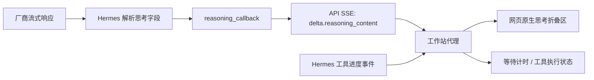

# 思考流、等待提示与工具状态

后续工具进度已细化为可持久化的检索式、来源、题名和读取回执，见 [研究过程实时显示](RESEARCH-ACTIVITY.md)。本文中的通用工具状态属于 v6 的初版行为。

核对及部署日期：2026-09-08。线上入口为 https://42.193.15.167 ，本文记录首次接通思考流的 `haudi-openwebui:0.11.3-research-v6`。后续 v7 保留这条通路，并增加模型状态，当前版本以根目录锁文件为准。

## 接入结论

同一种协议只需要一套显示逻辑。Qwen、Kimi、DeepSeek、GLM 的思考模型可以返回独立的思考字段；模型是否启用思考、是否允许输出这些内容，以及可用参数，仍由具体型号与厂商决定。不能保证所有型号都公开思考过程，也不能把等待提示写成模型的真实思考。

本项目的通路是：



## 为什么之前看起来卡住

本项目固定版本的 Hermes 在 `agent/chat_completion_helpers.py` 中已经解析 `reasoning_content` / `reasoning`，并经 `agent/stream_delivery.py` 调用统一的 `reasoning_callback`。但 `/v1/chat/completions` 路由此前只接入正文回调，思考内容没有进入该接口的 SSE 响应。

另一个断点是工具状态：Hermes 发出的 `event: hermes.tool.progress` 不是网页后端直接识别的状态事件。nginx 原本已经关闭响应缓冲，单独修改代理配置无法解决这两个断点。

本次修改：

1. 在 `gateway/platforms/api_server.py` 的 Agent 创建与执行入口透传 `reasoning_callback`；在 `api_server_openai_routes.py` 把回调片段写为 `delta.reasoning_content`，和正文共用线程安全队列。
2. `overlays/open-webui/workstation_models/streaming.py` 保留模型正文、思考和 usage 字段，把工具生命周期转为网页原生 `status` 事件。
3. 请求上游响应头之前先发“正在连接科研助手”；等待期间每 10 秒更新耗时。实际收到思考或正文后分别显示“正在思考”“正在生成回答”，执行工具时显示任务数量。
4. 上游报错或异常断流时给出错误状态，取消请求时释放代理连接。心跳不会取消正在等待的上游读取。

网页已有独立思考区，支持流式更新和折叠，本次无需重建前端。只展示厂商实际返回的思考内容；没有该字段时仍有等待和工具状态。非流式请求、`/v1/responses` 及其他原生会话接口没有在本次扩展思考输出。

## 新型号怎么接

| 厂商 | 公开思考字段 | 启用方式的差异 |
| --- | --- | --- |
| Qwen | `reasoning_content` | 部分型号使用 `enable_thinking`，默认值和能否关闭依型号而定 |
| Kimi | `reasoning_content` | 依型号区分思考模式与强度，查该型号的接口参数 |
| DeepSeek | `reasoning_content` | 依型号配置 `thinking`、思考强度等参数 |
| GLM | `reasoning_content` | 依型号配置 `thinking`，多轮工具调用另有思考保留规则 |

表格是协议与参数类别说明，不是可以跨厂商复制的请求体。依据：[Qwen 深度思考](https://help.aliyun.com/zh/model-studio/deep-thinking/)、[Kimi 思考接口示例](https://platform.kimi.com/blog/posts/kimi-thinking)、[DeepSeek 思考模式](https://api-docs.deepseek.com/guides/thinking_mode/)、[GLM 深度思考](https://docs.bigmodel.cn/cn/guide/capabilities/thinking)。Kimi 链接展示其思考接口协议，新增型号的开关与强度值仍须核对对应型号文档。

接入步骤：

1. 在 `configs/workstation/model-catalog.json` 添加或调整型号、厂商和区域地址，沿用个人密钥验证与加密存储。
2. 核对 Hermes 对该厂商的适配及模型默认参数。本次沿用现有默认设置，没有强制打开全部型号的思考，也没有新增前端思考强度开关。
3. 使用有效 Key 检查真实响应是否含思考增量。符合现有协议的型号自动复用这条通路；新协议的差异集中在 Hermes 厂商适配层，不为型号增加独立前端组件。
4. 如需增加思考开关，必须在工作站后端增加明确的参数白名单和厂商映射。当前模型路由只透传已审核字段，不能假设浏览器任意附加的 `thinking` / `reasoning_effort` 会生效。
5. 验证等待、思考、工具调用、最终回答、取消与失败情况。工具间多轮思考的回传和上下文保留继续由 Hermes 处理，前端只负责显示。

上游参考：[Hermes API Server](https://hermes-agent.nousresearch.com/docs/user-guide/features/api-server/)、[Open WebUI 思考模型显示](https://docs.openwebui.com/features/chat-conversations/chat-features/reasoning-models/)。后者原生识别 `reasoning_content`、`reasoning`、`thinking`；当前 Hermes 通路统一输出 `reasoning_content`。

## 验收证据

2026-09-08，经生产 HTTPS 聊天接口实测，单位为秒，计时从测试客户端开始请求算起：

| 型号 | 首个状态 | 首个思考片段 | 首个正文片段 | 思考片段数 | 工具状态 |
| --- | ---: | ---: | ---: | ---: | --- |
| DeepSeek V4 Flash | 0.097 | 3.048 | 9.407 | 412 | 收到 |
| DeepSeek V4 Pro | 0.063 | 1.826 | 21.636 | 503 | 收到 |

这些是一次请求的观测值，不是延迟承诺。独立浏览器空白任务中，已确认等待提示、“思考用时”折叠区、工具状态及最终 DOI 引用。浏览器验收记录位于服务器 `openwebui/streaming-browser-verification.json`；临时个人测试 Key 已删除。

Qwen、Kimi、GLM 尚未逐一使用有效 Key 完成线上思考流验收，不能将协议兼容测试等同于这些厂商的实测。

自动检查共 16 项通过：8 项转发行为测试、1 项实际 aiohttp SSE 传输测试、7 项现有模型与凭据测试。转发测试覆盖首个状态早于上游响应头、心跳不取消请求、思考字段和 usage 保留、工具事件、无思考响应、HTTP 错误、异常断流和取消清理。传输测试用受控生产者确认 Agent 尚未完成时客户端已经收到思考片段。

```powershell
python scripts/prepare_sources.py --check
python -m unittest discover -s tests -p test_workstation_streaming.py -v
python -m unittest discover -s tests -p test_hermes_reasoning_stream.py -v
python -m unittest discover -s tests -p test_workstation_models.py -v
```

Hermes 传输测试需安装 Hermes 依赖，并允许本地测试服务器监听回环地址。发布时还会在新 UI 镜像中离线运行转发测试，再针对服务器 Hermes 源码运行传输测试。

## 发布与回退

源码修改的持久入口是覆盖层和 `scripts/render_product_patches.py`，生成的两个补丁也须提交；不要只修改 `reference/` 或在线容器。上游升级时重新检查 API 方法签名、回调和 SSE 结构。

`scripts/package_streaming.py` 从指定 Git 基线重建旧版本文件哈希，将当前源码、覆盖层和测试打包。当前已部署的发布包编号为 `3ff29dbe9f94ef91`，由 v5 升到 v6，其基线提交为 `4110415b501086c3a0c3f08055fe321564a23b32`：

```powershell
python scripts/package_streaming.py --baseline-ref 4110415b501086c3a0c3f08055fe321564a23b32
python deploy/hermes/upload.py .build/streaming-release.tar.gz /home/ubuntu/haudi-hermes/streaming-release.tar.gz
python deploy/hermes/upload.py deploy/hermes/deploy-streaming.py /home/ubuntu/haudi-hermes/deploy-streaming.py
python deploy/hermes/remote.py deploy/hermes/deploy-streaming.sh
```

这是 v5 升级路径；生产已经过该升级，重复执行会因基线镜像不同而停止。后续发布先调整目标镜像标签，以已部署版本对应的 Git 提交作为 `--baseline-ref`，再生成发布包。脚本在更改服务前校验镜像、旧文件和包内哈希，构建与测试通过后才切换；失败会恢复旧引擎文件及容器。新环境的完整安装仍遵循其他部署说明，该脚本不是首次安装器。

在线真实模型验收（会产生 API 调用）：

```powershell
python deploy/hermes/upload.py deploy/hermes/verify-streaming.py /home/ubuntu/haudi-hermes/verify-streaming.py
```

在服务器执行 `cd /home/ubuntu/haudi-hermes && venv/bin/python verify-streaming.py`。脚本在服务器内读取管理员凭据，按需临时使用既有 DeepSeek Key，测试后删除临时个人 Key，不输出密钥和模型思考正文。每个型号完成后保存 `openwebui/streaming-verification.json`，后续失败也保留已完成型号的证据。

可选浏览器验收要求已有 `haudi-streaming` 测试浏览器会话，登录管理员并进入空白新任务；依据最新 DOM 快照传入 `--browser-input-ref @实际引用`。`--browser-only` 可只重试浏览器验收。不要对正在使用的普通用户会话运行测试。

部署记录：`openwebui/streaming-deployment.json`。此次回退文件在 `streaming-backups/20260908T074037Z`，旧容器为 `haudi-openwebui-before-streaming-20260908T074037Z`。仅回退此次发布时，在服务器核对记录后执行：

```bash
cd /home/ubuntu/haudi-hermes
cp streaming-backups/20260908T074037Z/gateway/platforms/api_server.py source/gateway/platforms/api_server.py
cp streaming-backups/20260908T074037Z/gateway/platforms/api_server_openai_routes.py source/gateway/platforms/api_server_openai_routes.py
sudo systemctl restart haudi-hermes-api.service
sudo docker stop haudi-openwebui
sudo docker rename haudi-openwebui "haudi-openwebui-streaming-reverted-$(date -u +%Y%m%dT%H%M%SZ)"
sudo docker rename haudi-openwebui-before-streaming-20260908T074037Z haudi-openwebui
sudo docker start haudi-openwebui
sudo docker inspect haudi-openwebui --format '{{.Image}}' > openwebui/image.txt
curl --fail http://127.0.0.1:8642/health
curl --fail https://42.193.15.167/health
```

这套回退保留账号、聊天、密钥数据库和 HTTPS 配置；后续版本上线后，应使用对应发布的备份，不套用这里的时间戳。
