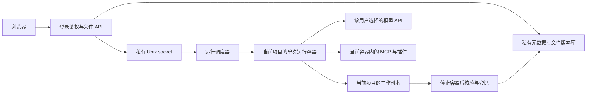

# 项目工作区开发与验收

状态：2026-09-10 已切换正式服务器，入口为 `https://42.193.15.167`。历史迁移、HTTPS、文件归属、历史文件页面／导出，以及真实模型上传、生成、多对话共享文件的生产验收均已通过。逐项证据见 [验收对照表](WORKSPACES-ACCEPTANCE.md)。

## 产品与数据关系

系统只有一种顶层任务实体，界面称为“项目”。每个项目属于一个用户，拥有唯一文件工作区和一条或多条对话。点击“新建”或“新增对话”先进入草稿；首次发送消息或成功上传附件才保存。未发送文字、空白刷新和重复点击不创建项目。对话共享项目文件，分别保存消息上下文；新增对话不建立新工作区。项目名称默认随首条对话标题更新，只有附件时先使用文件名，手动改名后停止自动覆盖。删除对话保留文件，删除项目进入项目回收站。

左侧项目元素提供资源管理器与对话列表；中间显示当前对话，右侧查看、编辑文件。文件 ID、项目 ID 与相对路径分别承担引用、归属和显示职责，服务器物理路径不是下载接口。

只有一条对话时，项目标题已是打开入口，列表不再重复展示同名子项；其删除操作放在项目菜单中。多条对话时显示各自标题。空资源区保留文件操作，不增加引导占位文字。旧版本产生的纯空白项目从导航隐藏，底层记录不删除；包含文件、目录或有效消息的项目继续显示。

`POST /api/workstation/drafts/{草稿UUID}/commit` 验证当前账号的首次输入和附件归属，并以用户与草稿 ID 得到稳定对话 ID；重试不会重复创建项目。首次附件导入与工作区绑定使用同一事务。原 `POST /projects` 仍用于受控的预置／维护，但空记录不会进入普通导航。当前草稿流程的 HTTP 和网页验证入口是 `deploy/workspaces/verify-drafts.py`；早期 `verify-browser-workflow.py` 的预置空项目页面步骤对应本次变更前的验收，不用于复验新草稿交互。

## 修改入口

| 路径 | 职责 |
| --- | --- |
| `overlays/open-webui/workspaces/` | 项目导航、文件预览编辑、账号与项目切换状态 |
| `overlays/open-webui/workstation_workspace/store.py` | SQLite 元数据、不可变版本、权限、配额、文件操作 |
| `workstation_workspace/router.py` | 登录用户鉴权后的项目、对话和文件 API |
| `workstation_workspace/bridge.py` | 验证原生聊天归属，导入原始附件，调用私有调度器 |
| `workstation_workspace/runs.py` | 当前项目快照、运行结束收集、版本冲突和中断恢复 |
| `workstation_workspace/public_paths.py`、`public_stream.py` | 流式内部路径过滤及原生文件事件 |
| `workstation_workspace/migration.py`、`legacy.py`、`history.py` | 原始附件迁移、旧产物归属证明、历史消息文件引用修复 |
| `deploy/workspaces/broker.py` | 私有 Unix socket 服务及实际隔离容器生命周期 |
| `deploy/workspaces/prepare-runtime.py`、`Dockerfile.runtime`、`worker_boot.py` | 构建无个人状态的公共镜像、启动单次运行 |

表中的 `workstation_workspace/` 均位于 `overlays/open-webui/`。覆盖层通过 `scripts/render_product_patches.py` 纳入补丁，再应用到固定版本的 `reference/`。请修改覆盖层或补丁生成器；直接修改 `reference/` 不会自动成为团队可复现的变更。

## 执行与存储边界



只有执行副本挂载到 Worker；版本库、其他项目、账号库和 Docker socket 不挂载。Worker 使用 UID/GID 1000、只读根文件系统、移除 capabilities、禁止提权，并限制内存、进程数及临时文件系统。MCP、插件和终端在同一容器边界内运行。CFD 输出位于当前工作区，LaTeX 工程也必须写入当前工作区；插件不能依赖跨运行的全局项目注册表。

调度器使用 root 身份启动容器，因而只能通过可信后端可访问的 Unix socket 提供服务。不得将该 socket 公开为无鉴权 TCP 接口。浏览器请求不能自报用户归属、容器路径或运行凭据。启用 `WORKSTATION_WORKSPACE_ROOT` 后，旧模型及直接连接入口会被拒绝；正式切换还必须停止旧共享 Agent 服务，避免保留其他旧代理入口。

内容按稳定文件 ID 和版本号存储。用户保存采用版本比较；Agent 与用户编辑冲突时保留双方结果。完成运行且容器移除后才清理执行副本；中断或失败副本保留供恢复。发布和 ZIP 解包采用事务，失败时回滚本次元数据和未提交内容。

中断运行不自动合并输出，也不覆盖已有文件。项目菜单的“未完成文件”列出可恢复运行；用户点击“恢复文件”后，修改过或新增的内容才导入 `未完成文件-<运行短标识>` 目录。原文件和用户后续编辑保持原样，重复恢复不会重复导入。目录内的内容仍可能不完整，需要检查后使用。对应接口为 `GET /api/workstation/projects/{project}/recoverable-runs` 和 `POST /api/workstation/projects/{project}/recoverable-runs/{run}/recover`，二者均检查登录用户与项目归属。

取消请求时，调度器会等待已经进入后台线程的快照、容器启动或文件提交操作结束，再执行清理。不能把取消异步等待等同于停止后台线程。私有 socket 的 `POST /drain` 停止接收新运行；`GET /health` 返回维护状态及尚未结束的请求数；`POST /resume` 恢复接收。维护时应等待请求数为零，再核对数据库与真实容器状态。服务正常停止会取消活动请求并完成清理，异常退出则由下一次启动确认、停止遗留容器后恢复运行状态。

默认容量为单文件 64 MiB、项目当前文件 512 MiB、当前节点 5000；项目保留版本 2 GiB／20000 个，单用户全部保留版本 4 GiB。已删除文件仍计入历史容量。超额拒绝新写入并保留旧版本；管理员调整限制时应同步 API 与调度器的 `WorkspaceStore` 配置。

## 本地准备和检查

先按 [开发指南](DEVELOPMENT.md) 准备固定上游与依赖，再执行：

```powershell
python scripts/refresh_source_patches.py
python -m unittest discover -s tests -p "test_workspace*.py" -v
python scripts/build_workstation_ui.py
python scripts/package_model_release.py
python scripts/package_workspace_sources.py
```

工作区测试使用真实临时 SQLite 和文件；符号链接、硬链接、FIFO 的生产路径检查需要 Linux。前端类型检查沿用 `reference/open-webui` 的 `npm run check`。构建成功不等于编辑竞态、文件渲染或实际容器边界通过。

当前服务器脚本绑定现有部署根目录，`remote.py`／`upload.py` 还依赖维护者的 Windows SSH 别名。新同事应配置自己的已授权 SSH 身份，不复制私钥。这组脚本目前不是任意新服务器的一键安装器。

## 预览与运行镜像

`prepare-runtime.py` 在指定的新构建目录复制公共代码、依赖与已审核扩展，并从受限字段生成镜像配置；不会复制活跃会话数据库、记忆或 `.env`。`--assets` 目录需要 `Dockerfile.runtime`、`worker_boot.py`，如需使用已审核的 LaTeX 覆盖实现，另放置 `latex-tools.py`。构建基础镜像和部署的最终镜像都应记录不可变摘要，不能以浮动标签作为验收依据。

`stage.py` 构建 WebUI 预览镜像，使用独立数据库副本、文件版本库及回环端口。已有预览使用 `--replace-preview`，原容器会停止并改名保留。当前脚本不会在任意失败点自动完成回退；启动失败须按发布记录核实并恢复原预览容器，不覆盖已经产生新写入的数据。

`install-broker.py` 从已校验的源码 release 安装预览调度服务；它拒绝覆盖活跃调度器。更换前核实活动运行和真实容器状态，保存服务配置，停止服务，再安装新版本。不要只依据数据库中的状态推断容器已经停止。

## 验收脚本及范围

以下脚本位于 `deploy/workspaces/`，默认面向私有预览。账号、令牌和凭据留在服务器，输出不包含私人研究内容。

| 脚本 | 实际覆盖范围 |
| --- | --- |
| `verify-api.py` | 两账号的 HTTP 文件归属、原始附件、版本冲突、稳定引用、ZIP 和项目恢复 |
| `verify-runtime.py` | 默认只预检新项目中固定合成文本；显式执行模式才调用已有配置的官方模型并核对生成文件 |
| `verify-browser-workflow.py` | 真实页面上传合成文件、选择可用模型、生成文件卡片、刷新持久化、新增同项目对话并继续使用文件；已完成的探针不能直接重发 |
| `verify-latex-runtime.py` | 合成模板的真实主模型与插件辅助模型生成、校验和打包；`--verify-existing-output` 只检查既有 ZIP、原模板和编译配方，不重放模型调用或流式过程 |
| `verify-isolation.py` | 使用真实调度器启动容器，检查跨用户／跨项目文件、终端、链接与容器网络 |
| `verify-broker-lifecycle.py` | 专用调度器、真实 UDS 和 Docker、固定文本 SSE 测试 Worker；验证排队取消、运行取消、维护停写、崩溃重启与优雅停止，不调用 LLM |
| `verify-worker-extensions.py`、`check-worker-extensions.py` | 实际工具注册、stdio MCP、CFD PNG/GIF、LaTeX 工程重开和 ZIP；不调用辅助 LLM |
| `verify-browser.py`、`verify-media.py` | 真实页面编辑、项目切换、Markdown/PDF/图片/CSV 及移动端预览 |
| `verify-preview-file-moves.py` | 改名后类型刷新、Markdown 和图片移动后的相对引用 |
| `verify-editor-save-race.py` | 用有时限的预览数据库锁延迟实际保存，在此期间继续输入并切换文件，核对两版内容 |
| `verify-recovery-browser.py` | 合成中断副本的显式恢复、菜单收起、独立目录、原文件与恢复文件预览、重复恢复与重载持久化 |
| `verify-account-switch.py` | 实际上传等待数据库锁期间退出 A 并登录 B；检查健康响应、页面清空、迟到上传归属、直接文件 ID 拒绝及重新登录后的可读性 |
| `verify-release-roundtrip.py` | 检查点之后创建合成文件两版本和原生消息，实际切到兼容旧镜像再切回；分别检查鉴权下载、消息、文件卡片及浏览器渲染 |
| `verify-execution-gate.py` | 真实 HTTP 拒绝旧模型，以及已部署函数拒绝直接连接绕行 |
| `rehearse-migration.py` | 独立快照中完成归属迁移、未知文件隔离、历史消息修复与幂等检查 |
| `verify-history-browser.py` | 真实历史文件所属账号打开原消息卡片并渲染，从实际菜单下载 JSON 后核对内容与附件元数据；私人材料留在服务器，结束时退出账号并清理临时凭据及导出副本 |
| `verify-native-file-api.py` | 合成附件的上传、列表、搜索、详情、改名公开响应不含存储路径；原件不变，测试附件结束后删除 |
| `verify-uploaded-formats.py` | 实际上传 Markdown/PDF/PNG/GIF/ZIP，由实际 Hermes 终端读取并核对原件；登记终端结果、检查同项目第二对话及显式导航状态，不调用 LLM |
| `verify-preview-fallbacks.py` | 大文件、未知格式、损坏图片／PDF 的实际页面提示和原件下载；HTML 仅显示源码 |
| `verify-cfd-browser.py` | 内置合成 CFD 样例通过真实模型／MCP 生成 PNG/GIF，核对完成回执、原生消息卡片、鉴权下载、实际右侧渲染和刷新；开始过的运行不能重发 |

浏览器脚本需要先创建并保留合成账号、登录专用浏览器会话，再依据当前可见控件选择指定项目。脚本文件存在不表示该版本已经通过；以对应验证记录的源码、镜像及时间为准。

需求、证据与各项验证范围见 [验收对照表](WORKSPACES-ACCEPTANCE.md)。

对话所属项目的只读查询使用 `GET /api/workstation/threads/{thread}/workspace`；用户打开对话时使用 `POST /api/workstation/threads/{thread}/open`，后者才记录最近打开的对话。后台鉴权、文件关联和运行快照不能修改这一导航状态。该接口变更须与前端及调度器所用存储实现一起发布。

文件上传和新增对话的目标权限检查也必须放入后台线程。`WorkspaceStore.db()` 会取得 SQLite 写锁，即使调用方只做归属查询也可能等待；在异步路由中直接进入该事务会阻塞健康检查、退出登录等无关请求。账号切换验收曾实际发现此问题，修复后在真实上传锁仍被持有时，健康检查与 A/B 登录切换通过。

## 兼容版本回退

`deploy/workspaces/release-control.py` 在服务器以 root 身份执行，默认只管理私有预览。它保存镜像、隔离挂载、当前调度器服务单元及数据库结构的检查点；只有调度器相同、结构兼容的工作区版本之间才允许切换。检查点不是任意镜像的兼容承诺，仍需实际验收。

```bash
cd /home/ubuntu/haudi-hermes
sudo venv/bin/python workspace-build-assets/release-control.py capture --scope preview
# 使用上一步实际返回的检查点路径及当前镜像摘要替换占位值。
sudo venv/bin/python workspace-build-assets/release-control.py switch --scope preview \
  --checkpoint '/home/ubuntu/haudi-hermes/workspace-release-checkpoints/preview-<时间>.json' \
  --expect-image 'sha256:<当前镜像摘要>'
```

切换会阻止新运行，等待已有运行结束，停止写入服务，备份当前 WebUI 数据与整个工作区，再启动目标镜像。旧容器保留；目标镜像继续使用当前数据库、文件版本和消息，不恢复旧快照。新镜像启动失败且结构未变时，工具恢复切换前镜像并保留失败前新增的数据；若结构已变，则保留所有数据并停止自动恢复，进入待人工检查状态。记录位于私有 `workspace-release-backups/<时间>/release-event.json`。

该工具已经在预览环境完成真实往返回退，两个版本的合成文件、检查点之后新增的消息、文件卡片和跨账号拒绝均保留。另有三项 Linux 故障注入测试覆盖目标启动失败、备份失败、结构变化；其中服务由测试替身提供，不冒充真实服务故障证据。`--scope production` 需要完整的生产工作区、隔离调度器及对应记录，不能用来直接迁移旧共享服务；首次正式切换仍遵循下节要求。

## 迁移与正式切换前提

旧顶层聊天各迁为一个项目及首条对话。原始上传按真实账号和消息引用迁入；旧 Agent 产物需要已归属的会话、成功工具回执及与当前文件一致的内容证据。多个用户或对话都有相同文件的归属证据时，不自动分配。未知文件保留在管理员隔离区，不挂载到 Worker。

历史回复修复同时处理聊天 JSON 与规范化消息记录。有证据的文件补为鉴权文件引用，其他内部路径隐藏；用户原始消息保留。修复应在备份副本演练，再在停止写入的切换窗口应用；不能一边继续写原数据库，一边覆盖整个旧快照。

附件清理也覆盖用户消息的文件对象及其嵌套原生文件元数据，防止导出中的 `file.path` 暴露物理路径；用户消息正文和原始文件字节不改写。原生文件 API 的上传、列表、搜索、详情和改名响应应同步排除存储路径，不能仅修复工作区 API。

`migration-batch.py` 将原生附件、有证据的旧产物、历史消息修复、未知文件隔离和重复执行校验组合为离线批次。`migrate-preview-history.py` 在停止预览写入且完成备份后将真实历史导入保留的预览，原生产数据只作读取来源。预览含验收账号及合成聊天，禁止把整个预览数据库作为生产迁移结果。

首次切换工具为 `production-cutover.py`，须从校验过的不可变源码 release 目录运行。先用 `plan --source-release <源码摘要>` 生成私有计划；审查计划、当前生产活动任务及同版本历史页面验收后，才使用 `apply --plan <实际计划路径>`。工具在停止旧生产入口和旧 Agent 进程组后备份生产数据库、Agent 状态和共享文件，再迁移当前生产数据并安装正式独立调度器。随后必须执行 `configure-model-discovery.py` 配置独立模型目录，再进行实际模型验收。`active` 和健康检查通过只代表服务已启动，不能代替模型调用成功。

生产迁移一旦进入隔离数据阶段，故障处理会保留现场并停止接收请求，不自动启动旧共享 Agent。旧服务通过禁用开机启动和以生产工作区记录为条件的服务启动限制阻止误启。现场恢复依据私有 `workspace-production-backups/<时间>/cutover-event.json` 中实际完成的步骤进行；不得盲目重跑首次迁移或删除生产工作区记录以绕过限制。

每次正式发布均需核对：活动任务停写与停止确认、数据库和文件版本库一致备份、迁移复核、历史文件页面、实际多线程工作流，以及适用的取消／重启、用户切换和回退证据。回退必须保留切换后的新文件、版本和消息，并维持文件隔离；不能简单重启旧共享 Agent 或覆盖为旧数据库。

生产镜像、数据根、服务单元、迁移统计和回退动作应写入部署记录。未完成上述检查前，预览验证不能标记为正式发布。

## 容量、保留与维护

当前实现不自动销毁历史版本、回收站项目、归属不明的迁移文件或未完成的运行副本。项目删除为软删除；删除线程不释放文件，也不删除版本。超过版本或当前文件配额时拒绝写入，现有内容继续可读。不要手工删掉 `versions/` 中的文件来“腾空间”，这会使数据库仍指向不存在的历史版本。

容量参数集中在 `overlays/open-webui/workstation_workspace/store.py` 的 `WorkspaceStore` 构造函数。目前没有已实现的配额管理页面或配额环境变量；扩容需修改这些默认参数，并将相同实现发布到 WebUI 和调度器。先执行容量、事务及冲突检查，再在维护窗口一致备份并部署；降低上限之前先核实已有用量，不能删除用户版本来使测试通过。

正常完成的运行在容器停止、移除并确认成果已提交后清理执行副本。调度器重启时也检查当前存储中已知的遗留运行；已经提交但未完成清理的容器／副本会被回收。失败或中断副本保留，用户通过“未完成文件”恢复到新目录。恢复后仍保留原副本，目前没有定时清除策略。磁盘检查应同时计算数据库、`versions/`、`runs/`、诊断、发布备份和迁移隔离区，不能只看当前文件总量。

维护时先通过私有 socket 的 `/drain` 停止接收新运行，等待 `/health` 的 `requests` 为零；再停止对应 WebUI 和调度器，并确认该存储的已知运行容器均已停止。对 WebUI 数据目录和整个工作区同时备份，核对 SQLite 完整性后才进行迁移或维护。备份应覆盖中断副本，不只复制 `versions/`。完成后启动调度器、`/resume`、启动 WebUI，并验证文件当前版、历史版及另一个账号的拒绝访问。上述流程由 `release-control.py` 的兼容发布操作实现；人工故障恢复也应保持同样的停写与数据保留顺序。

当前保留策略刻意不提供绕过归属检查的清理命令。需要清理未完成副本或旧备份时，先确认恢复／备份策略和具体记录，再使用经核对的单个路径操作；不要对整个工作区运行递归删除。归属不明的旧文件只能由管理员根据新证据确认后受控导入，不能通过开放隔离目录访问权限交给全部用户。

## 本次正式部署记录

2026-09-10 用户明确批准“切换”后，实际执行计划 `workspace-production-plans/20260910T095918625935Z.json`。正式 UI 镜像为 `sha256:8db0b33d118e866891bec929872aa68bf0ec1fec7a634a18ef964d56e5dc11c1`，调度器源码 release 为 `03f5ff45af2139bf`，运行镜像 v3 为 `sha256:9fa5137570be79593590941e3030c3df2240fd380601575c738547adf13fd1f5`。

以下路径均相对于服务器私有部署根，仅供维护人员使用，不作为面向用户的文件链接：

| 项目 | 实际位置或服务 |
| --- | --- |
| 正式 WebUI 数据 | `openwebui/data`，沿用正式数据库 |
| 正式项目存储 | `workspace-production-store` |
| 正式私有调度器 | `haudi-workspace-broker-production.service` |
| 正式调度 socket | `workspace-production-broker/broker.sock` |
| 部署与调度记录 | `workspace-production.json`、`workspace-broker-production.json` |
| 一致备份与迁移记录 | `workspace-production-backups/20260910T100317185752Z` |
| 停止保留的旧 UI | `haudi-openwebui-legacy-before-workspaces-20260910T100317185752Z` |
| 正式验收记录 | `workspace-production-verification.json`、`workspace-production-browser-workflow-verification.json` |
| 正式发布检查点 | `workspace-release-checkpoints/production-20260910T101712533328Z.json` |

保留原有 6 个账号和 20 条对话的身份归属；迁移 1 个原生附件、6 个有证据的历史产物，7 份内容哈希吻合；16 个归属不明文件进入管理员隔离区。原始用户正文及源文件保持原样，重复迁移 ID 稳定。预览账号和预览数据库未导入正式环境。

旧 `haudi-hermes-api.service` 已停用并禁用启动，8642 端口关闭。该旧网关正常停止也可能返回退出码 1，因此单元显示 `failed`；停止判定同时核对主进程为零、子进程组为空和监听端口关闭，不能只看单元历史退出结果。迁移前第一次执行因旧判定过严而退出，已恢复原服务；当时尚未迁移。修正后 39 项 Linux 检查通过，再用新计划完成正式切换。

上线验收使用真实所属账号检查历史文件，通过 HTTPS 实际打开卡片、右侧预览并下载 JSON，临时历史登录材料和导出副本已清理。新文件工作流使用单独标记的合成账号；`verify-browser-workflow.py --scope production` 只发送固定合成文本到已核对的模型官方端点，执行结束移除临时模型密钥；`verify-production.py cleanup` 移除该账号授权、软删除合成项目并删除测试账号。不要用正式研究账号代替此合成账号。

10:17 UTC 的正式验收全部通过：浏览器上传原件，默认选中可用模型，真实 DeepSeek 读取原件并生成 Markdown；卡片与预览刷新后保留；从界面新增同项目第二条对话后成功读取已有成果并交付新文件，各自消息历史独立。临时账号、基座／目标模型授权和密钥已移除，合成项目按回收策略软删除，专用浏览器已退出，没有遗留活动测试 Worker。正式检查点在清理后生成，保留当前生产数据。

本次已有工作区，今后的兼容发布使用 `release-control.py --scope production` 的检查点流程。首次迁移器不得直接重跑。预览的生命周期、账号切换和镜像往返回退演练仍是独立证据，不能写成在正式用户数据上重复进行了故障演练。

### 模型目录与旧服务解耦

正式切换发现：原上游连接通过旧网关的 `/models` 获取基座，8642 停止后整个可见目录可能为空，预览期间旧服务在线则不会暴露该问题。`configure-model-discovery.py` 使用上游已有的 `OPENAI_API_CONFIGS[index].model_ids` 设置静态 `hermes-agent` 基座，并清除模型缓存；它只用于现有预设的权限和目录解析，仍在 UI 隐藏。`ws-*` 生成请求继续经隔离工作区桥接，其他共享入口由既有执行门禁拒绝。

修复通过受支持的管理员 API 完成，完整旧配置只保存在服务器私有 `workspace-model-discovery-config-before.json`；现有账号授权不变。`workspace-model-discovery-verification.json` 记录旧网关仍停止、9 个科研模型可列出、共享基座隐藏。目录可见与“有有效个人密钥且厂商当前可用”是不同条件，后者仍由既有模型检测处理。


## 2026-09-10 侧栏与草稿更新

正式镜像更新为 `sha256:10ac63aa079fe3fb003071a689c7630ad4cdc9437d56afe4c35774dbf0b9ea4a`。项目只有一条对话时隐藏重复的对话标题，删除对话入口保留在项目菜单；新建只打开草稿，首次发送消息或成功上传附件才创建项目／对话；移除空文件区提示文字。未发送文字不创建项目，已有空白项目仅从导航隐藏。

42 项 Linux 工作区测试通过。`workspace-draft-production-verification.json` 记录正式网页的连续新建、首次上传、首次真实模型回复、同项目追加对话、附件不重复导入及临时账号清理；`workspace-draft-production-audit.json` 确认发布前的 6 个账号、26 条聊天和 10 个文件版本保留。备份为 `workspace-release-backups/20260910T110250333827Z`，检查点为 `workspace-release-checkpoints/production-20260910T110841361837Z.json`；未恢复旧数据库，运行隔离保持不变。上述记录留在服务器私有目录。

另行尝试的未发送输入刷新缓存修正尚未完成页面验收，未纳入本次提交或正式发布。
