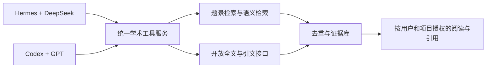

两种科研 Agent 方案的论文检索能力与可实施扩展

调研日期：2026-09-08。

结论：DeepSeek＋Hermes 与 Codex＋GPT 都能发现公开论文、调用学术 API、获取部分全文。Codex 提供现成的网页搜索集成；当前 Hermes 工作站的搜索和多步取文也已实际跑通。支撑科研工作流的关键建设是可复现的学术检索、可靠全文获取和证据管理。已验证的公开数据接口可以为两种方案共用，不需要因为数据源接入而先更换模型。

不能据此断言两种模型的科研质量相同，也不能断言 GPT 全面更优。本次没有进行统一模型、工具、网络、样本、预算条件下的召回率、准确率或综述质量评测。

**比较对象与证据边界**

| 对象 | 本次范围 | 证据 |
| --- | --- | --- |
| 方案 A | 当前服务器 Open WebUI＋Hermes 0.21.0＋deepseek-v4-flash | 已部署配置、两个真实 Agent 任务、工具调用数据库记录、18 项 API 请求探测 |
| 方案 B | Codex 使用 GPT、内置网页搜索、终端与可配置 MCP 的方案 | 当前 Codex 会话的搜索/阅读实测，以及 OpenAI 官方产品文档；不是某个指定 GPT 型号的受控跑分 |
| ChatGPT 学术应用 | 例如 Wiley Scholar Gateway | 独立的可选连接器；不能自动归入 Codex 或 GPT API 的默认能力 |
| OpenAI Deep Research API | 可选的研究执行服务 | 需要单独配置数据源；不等同于在 Hermes 中仅更换模型名 |

当前 Codex 会话实际搜索到 arXiv 原文及多条 PubMed 题录，并读取 arXiv HTML 第 3.2.1 节。没有调用用户未配置的付费学术库，也没有从服务器调用 OpenAI API。

**当前能力逐项比较**

| 能力 | DeepSeek＋Hermes 当前工作站 | Codex＋GPT | 工程判断 |
| --- | --- | --- | --- |
| 通用网页发现论文 | web_search 已实测，当前使用自动选择的网页后端 | 内置网页搜索，本会话已实测 | 两者均可用于探索，网页结果不是完整数据库结果集 |
| 指定论文查找 | 实测成功定位 arXiv、PubMed 文献 | 本会话成功找到同一 arXiv 论文及 PubMed 记录 | 可以建设按 DOI/PMID/arXiv ID 精确定位工具 |
| 主题检索与题录核验 | 真实 Agent 找到两篇 2024—2025 年碱基编辑综述，标识符核验通过 | 可搜索、打开网页、编写 API 查询脚本 | 不足以承诺穷尽检索；应固定检索式与筛选规则 |
| 日期、类型、字段、MeSH 检索 | 官方 API 参数已实测；尚未封装稳定工作站工具 | 可接同一 API；不是默认网页搜索直接拥有的全部字段语义 | 应由数据库适配器实现，不让自然语言代替可检查参数 |
| 跨学科覆盖 | 网页与可访问的 OpenAlex/arXiv 等提供基础 | 网页索引与相同可接 API 提供基础 | 不能根据品牌判断完整覆盖或把各数据库规模相加 |
| 中文论文 | 可以发现公开网页和被开放索引收录的记录 | 同样可以搜索公开网页 | 均未证明具备知网/万方完整数据库及全文权限 |
| 摘要获取 | PubMed/Europe PMC 摘要字段已实测 | 可使用相同接口 | 可明确交付；有些记录确实没有摘要 |
| 开放 XML/HTML 正文 | Europe PMC XML 和 arXiv HTML 已实测 | 本会话读取 arXiv HTML 成功；也可接 XML 接口 | 应校验身份、来源、章节、截断情况 |
| PDF | arXiv PDF 下载已实测；Hermes venv 缺少常用 PDF 解析库 | 可通过下载、解析工具或受支持的文件输入处理，取决于运行环境 | 两者都需要可靠解析；不能把所有 PDF/图表视为已读懂 |
| 公式与图表 | 一个公式核实任务成功，但先经历转换丢公式和浏览器超时 | 本会话网页读取保留了该公式；不是全面图表能力评测 | 公式需保留 MathML/LaTeX；图表与扫描件另行验收 |
| 引文网络 | OpenAlex 引用/被引、Europe PMC 被引、XML 参考文献已验证 | 可共享同一接口 | 可补充沿引文扩展检索、关联图和引文导出；原始图谱有缺失 |
| 语义找相似论文 | OpenAlex search.semantic 已实测 | 可接同一服务 | 无需依赖 GPT 才能提供语义检索；它不能代替穷尽式布尔检索 |
| 系统检索复现 | 尚未形成自动分页、去重、审计与证据归档完整流程 | 终端/脚本可实现，但安装 Codex 不等于已有该流程 | 两种方案都需要项目代码与验收 |
| 订阅全文 | 当前未配置 | 不因使用 GPT 自动获得 | 必须核对具体连接器、机构授权及 API 权限 |
| 科研推理质量 | 两个小任务证明可以执行工具，未评测长综述 | 本次未做对应固定模型评测 | 不给未经测量的胜率、召回率或“更懂科研”评分 |

Codex 的默认网页搜索使用索引缓存，可切换实时模式；MCP 可扩展外部工具。[搜索配置](https://learn.chatgpt.com/docs/config-file/config-basic)、[MCP](https://learn.chatgpt.com/docs/extend/mcp)。OpenAI Responses API 的 web_search 可设置域名过滤并返回来源信息，但“限定 PubMed 域名”仍是网页搜索，不等同于执行 PubMed 的完整字段检索。[官方 API 说明](https://developers.openai.com/api/docs/guides/tools-web-search)。

Hermes 也支持本地/远程 MCP，因此同一个学术服务可以给两种方案提供一致工具。[Hermes MCP](https://hermes-agent.nousresearch.com/docs/user-guide/features/mcp/)。技能文件可以规定科研流程，但不会自行授予数据库、全文或 API 使用权限。

**真实 Agent 任务的结果与问题**

任务 A1：给定 Attention Is All You Need（1706.03762），要求读取正文并核实缩放因子。通过工作站实际调用 DeepSeek/Hermes，耗时 92.9 秒。数据库记录显示两次 web_extract、一次 browser_navigate、一次 terminal。HTML 转文本先丢失公式，浏览器导航超时，随后终端从 HTML 源码提取公式标记。最终给出的 1/sqrt(d_k) 和第 3.2.1 节与原文一致。[原文](https://arxiv.org/html/1706.03762v7)。

这证明定点获取、工具切换和一个公式核验案例可行；没有证明公式、图表、参考文献与附件的全面解析质量。Agent 自称获取“完整全文”仍需由完整性检查确认。

任务 A2：检索两篇 2024—2025 年 base editing 综述并核验题录。实际完成一次 web_search、两次 web_extract，耗时 61.2 秒。独立用 PubMed EFetch 核查如下：

| PMID | DOI | 年份 | 类型 | 核验 |
| --- | --- | --- | --- | --- |
| 40480225 | 10.1016/j.chembiol.2025.05.003 | 2025 | Review | 标题、年份、PMID、DOI 对应正确 |
| 39454989 | 10.1016/j.mrrev.2024.108515 | 2024 | Review | 标题、年份、PMID、DOI 对应正确 |

A2 还暴露了来源核验问题：同一 PubMed URL 的提取结果，第一次像题录页，后一次出现以 Introduction 开始的长正文。Agent 因此声称读到了全文片段。我们没有核验这些长文本的原始全文地址与完整来源，所以只把该任务计为“主题搜索与题录核验通过”，不计为这两篇付费/非开放论文的全文获取通过。

长文本、请求 URL、工具返回 success 都不足以单独证明“这就是目标论文的真实全文”。需要保留实际内容来源、跳转链或可信内容标识，核对题目/DOI/版本，才能进入用于实验设计的证据库。

**本次 API 扩展验证**

16 项首批请求中 15 项 HTTP 200；Europe PMC references 返回 503。另有 2 项 OpenAlex 精确短语/语义检索 HTTP 200。这里的 17/18 是这次不同功能探测的状态汇总，不是可用率或性能基准。

| 功能 | 实测证据 | 判定 |
| --- | --- | --- |
| PubMed 字段与日期查询 | 返回 PMID 列表和服务器解释后的检索式 | 可开发稳定工具 |
| PubMed 摘要与 MeSH | 样本文献返回 1,299 字符摘要、20 项 MeSH、DOI | 可开发稳定工具 |
| Europe PMC 核心元数据 | 日期/主题检索返回摘要、DOI、开放标记 | 可开发稳定工具 |
| arXiv 精确 ID 查询 | 1706.03762 返回 Atom 记录 | 可开发；上一轮主题请求超时说明仍需重试 |
| OpenAlex 精确短语 | 带引号的 base editing 查询返回论文 | 可开发；必须区分短语、词项与全文字段语义 |
| OpenAlex 语义检索 | 英文研究问题返回相关论文列表 | 可开发，限候选发现，不承诺系统综述召回率 |
| OA 副本定位 | 样本文献返回 6 个 OA 位置、PDF/结构化内容标记 | 可开发；实际下载仍要验证目标地址与许可 |
| OpenAlex 后向引用 | 样本文献返回 47 个 referenced_works ID | 可开发，数据库记录不保证参考文献完整 |
| OpenAlex 前向被引 | 返回被引计数 54 及所取 3 条论文记录 | 可开发，计数必须带数据源与获取日期 |
| Europe PMC 前向被引 | 返回计数 46 及所取 3 条记录 | 可开发，与 OpenAlex 数据不等价 |
| Europe PMC references | HTTP 503 | 此端点不能算本次成功；可回退到 XML 参考文献 |
| XML 章节与参考文献 | PMC3257301 返回 29 个 sec 元素、44 条参考文献、71,725 字符正文 | 可开发分章节阅读、参考文献提取与引用定位 |
| Crossref DOI 核验 | 与 PubMed/Europe PMC 标识符对应 | 可开发去重和引用核验 |
| Crossref BibTeX | 返回合法形态的记录并包含目标 DOI | 可开发引用导出 |
| bioRxiv/medRxiv 日更新 | 两者均返回所选日期记录、版本等元数据 | 可开发增量发现和版本追踪；全文需另测 |
| Semantic Scholar DOI 查询 | 返回题录、外部 ID、OA PDF 地址、引用数 | 精确查询可开发；上一轮主题搜索 429，配额问题仍在 |

API 文档：[PubMed](https://pubmed.ncbi.nlm.nih.gov/download/)、[Europe PMC](https://europepmc.org/RestfulWebService)、[arXiv](https://info.arxiv.org/help/api/user-manual.html)、[OpenAlex 搜索](https://help.openalex.org/api/searching/)、[OpenAlex 语义检索](https://help.openalex.org/api/semantic-search/)、[bioRxiv/medRxiv](https://api.biorxiv.org/)、[Semantic Scholar](https://api.semanticscholar.org/api-docs/snippets)。

这些数据还显示两个实际清洗需求：Europe PMC 主题检索的前 3 条中，2 条记录 DOI 相同但标题包含不同 HTML 转义；同一文献在 Europe PMC、Crossref、OpenAlex、Semantic Scholar 中的被引计数分别为 46、51、54、60。应合并论文身份，保留原记录与各库统计；不平均计数，不声称它们都是“总被引”。不同检索式/字段产生的命中总量也不能直接当作覆盖率比较。

**确定可实施的第一批补充能力**

下列能力有可调用的公开接口与返回字段作为依据，可以写成工作站工具。确定的是实现路径；不承诺第三方永久可用、任意论文可下载或所有主题完全覆盖。

| 优先级 | 工具/能力 | 实施输入与输出 | 两方案适配 |
| --- | --- | --- | --- |
| P0 | search_papers | 主题、布尔词组、日期、类型 → 各库检索式、结构化候选、来源 | 同一 HTTP/MCP 服务 |
| P0 | get_paper_metadata | DOI/PMID/PMCID/arXiv ID → 标准题录、摘要、版本、原始记录 | 同上 |
| P0 | resolve_fulltext | 文献 ID → OA 副本、格式、版本、许可、来源 | 同上 |
| P0 | fetch_and_read_paper | 经核验的地址 → 文件校验、XML/HTML 章节、正文片段及证据位置 | 同上 |
| P0 | verify_and_export_citations | DOI 核验、去重 → BibTeX/CSL/RIS/CSV | 同上 |
| P1 | find_related_papers | 研究问题/摘要 → OpenAlex 语义候选 | 同上 |
| P1 | follow_citations | 种子文献＋方向 → 引用/被引节点、来源与时间 | 同上 |
| P1 | watch_preprints | 来源、日期游标/主题规则 → 新记录、版本变化、已发表 DOI | 同上 |
| P1 | replay_search | 检索式、源、时间范围、分页参数 → 可复跑的检索记录与导出 | 应保存快照，重跑的实时结果可能变化 |

Crossref 支持 BibTeX、RIS、CSL JSON 等内容协商格式；本次直接验证了 BibTeX，其余格式可按同一官方协议接入后验收。[格式文档](https://www.crossref.org/documentation/retrieve-metadata/content-negotiation/)。

建议的最小结构是：

这样模型可以按任务替换，而检索式、论文身份、全文状态与引用证据不依赖某个聊天产品。前端应显示“候选发现 → 题录核验 → 全文定位 → 下载/解析 → 证据可用”，并分别显示仅摘要、正文片段、已校验全文、失败/需授权。

**有条件可接入，但不能算当前已经具备**

| 补充渠道 | 能补什么 | 当前缺少什么/不能承诺什么 |
| --- | --- | --- |
| OpenAlex 内容归档 | 部分论文的 PDF、GROBID TEI XML，减少本机解析工作 | 内容 API 密钥与用量条件；本次只验证 content_urls，未下载归档文件；解析结果仍需核验 |
| CORE | 机构知识库等来源的元数据和部分全文 | 注册 API Key、核对授权与额度、实测；未接入 |
| Unpaywall | DOI → OA 副本定位 | 独立 API 本次未调用；已通过 OpenAlex 验证同类能力；不应把重叠索引当作完全独立证据 |
| Semantic Scholar 稳定主题检索 | 相关论文与引文发现 | 申请/配置额度、缓存与退避；精确查询成功不代表主题检索没有限流 |
| Wiley Scholar Gateway | 在其覆盖内容中语义搜索，返回文献片段与引用 | 独立认证、查询配额；完整文章访问受授权限制；自建 Hermes/Codex 接入兼容性与许可未验收 |
| Scopus | 结构化文献/引文数据 | API Key 及相应数据访问权限；不同视图与用户授权不同；不是直接下载所有全文的服务 |
| Web of Science API | 题录、引用/被引和相关记录 | Expanded API 需要付费许可及应用注册；当前没有 |
| 万方 | 授权范围内中文文献检索 | 已发现需 AppKey/签名的官方接口；未提供应用凭据，覆盖范围和全文权利未确认 |
| 知网 | 可能补充中文学术覆盖 | 本次未验证适合本项目的开放调用方案及授权；不承诺自动接入 |
| 本地 PDF/科研资料库 | 用户合法提供材料的全文检索 | PDF/OCR 解析、分块、索引和项目权限建设；这是已有材料检索，不会增加外部文献权限 |

OpenAlex 内容归档的官方文档列出 PDF/TEI XML 下载及用量方式，同时明确内容保留原版权、解析可能有错误。[全文归档](https://help.openalex.org/access/fulltext/)。CORE 官方提供需要注册 Key 的元数据/全文 API，不能把“有 API”算作账号已经获批。[CORE API](https://core.ac.uk/services/api)。

Wiley 的官方材料证实 Scholar Gateway 存在，并支持在 ChatGPT 等产品中连接；其返回文章片段和引用元数据，全文访问取决于授权。因此它属于“可以申请与验证的专用渠道”，既不是 Codex 默认附送，也不能推断某个通用 MCP 客户端已经获得使用许可。[Wiley 连接说明](https://www.wiley.com/en-es/research/wiley-scholar-gateway/getting-started/)、[服务说明](https://www.wiley.com/en-ca/solutions-partnerships/customer-success-hub/wiley-scholar-gateway-hub/)。

商业和中文渠道条件分别见 [Scopus 官方说明](https://dev.elsevier.com/sc_apis.html)、[Web of Science API Expanded](https://developer.clarivate.com/apis/wos)、[万方文献查询接口](https://topic.wanfangdata.com.cn/api.html)。

不建议把 Google Scholar 页面自动抓取作为产品的稳定底座：官方不提供批量记录访问，并明确说明自动化访问和结果数量限制。第三方包装或所谓 Scholar MCP 不会消除这些限制。[Google Scholar 帮助](https://scholar.google.com/intl/en/scholar/help.html)。

**实施前应确定的验收条件**

- 同一 DOI 在不同库/不同 HTML 标题写法下合并为一个作品，原始来源保留；预印本和正式发表版本关联，但不粗暴合并正文。
- 每个查询保存源、翻译后的检索式、时间字段、筛选条件、分页游标、执行时间、错误和返回 ID。语义检索只标为候选发现。
- 用已知论文集测检索命中；用真实新主题测相关性。题录存在、内容相关、证据支持论断是三项独立检查。
- 无摘要、无全文、下载失败、正文截断、公式缺失都有明确状态；不能因模型回答流畅就提升到“已核验全文”。
- 引用绑定真实 DOI/PMID 与章节/页码；来源不能定位时不宣称可核验。引用数量不替代证据质量。
- 每个数据源独立限流、超时、退避和缓存；慢任务显示阶段与进度，不长期空白等待。
- 工作站账号与 Hermes 会话、工作目录、缓存权限、长期记忆的隔离需要实际实现并测试；当前多账号 UI 不构成这些能力已完工的证据。

当前服务器可先采用低并发、按需下载、XML/HTML 优先和轻量文本解析；是否加本地 OCR、向量库或大规模全文解析应另做资源测试。官方 PMC 要求使用指定的自动获取服务，采集实现应遵守其数据接口，而不是爬取整个网页站点。[PMC 自动获取说明](https://pmc.ncbi.nlm.nih.gov/tools/textmining/)。

**推荐选择**

针对现有网页、多账号、服务器部署，优先保留方案 A，补齐 P0 学术工具服务，并同步解决会话/资料隔离。方案 B 适合作为研究开发工具或后续可插拔执行端；它的现成网页搜索便利是真实优势，但现有证据不足以证明迁移后自动得到更完整的论文覆盖。

如果要决定 GPT 是否值得用于复杂综述，下一步应固定同一批候选文献、全文和工具，指定 GPT 型号，与 DeepSeek 做对照：检索动作是否正确、引用是否真实、阅读深度判断是否准确、方法细节是否提取正确、耗时与成本。OpenAI Deep Research 是另一条可选服务路线，需要显式接入数据源，不能混入“只换模型”的成本和能力估计。[Deep Research API](https://developers.openai.com/api/docs/guides/deep-research)。

本次完成了综合调研、实际 Agent 验收和补充接口可行性探测，没有安装新检索服务、购买账号、接入机构数据库或切换当前模型。

证据与复现：详细观测保存在 [JSON 证据](evidence/paper-retrieval-feasibility-2026-09-08.json)；脚本为 deploy/hermes/probe-agent-paper-workflow.sh、probe-agent-topic-search.sh、inspect-paper-agent-trace.sh、verify-topic-search-evidence.sh、probe-paper-extensions.sh、probe-semantic-paper-search.sh。沿用上一轮 [基础渠道调研](paper-access-review-2026-09-08.md) 中已验证的下载和配置事实。
